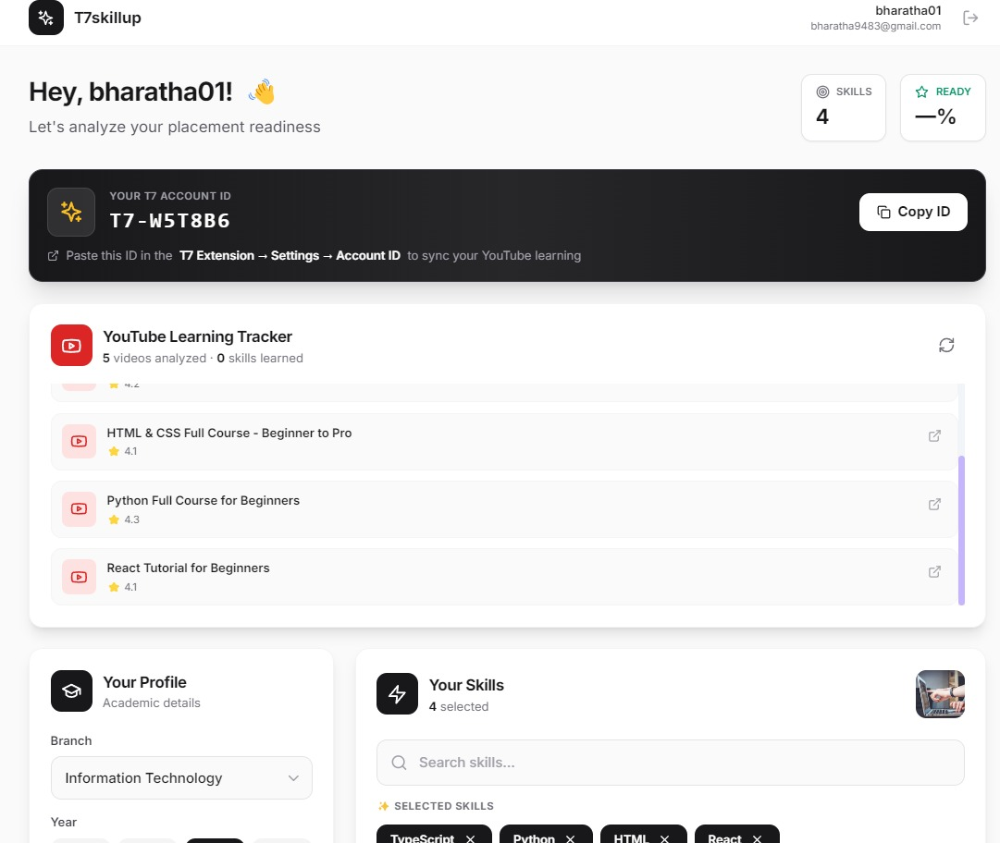
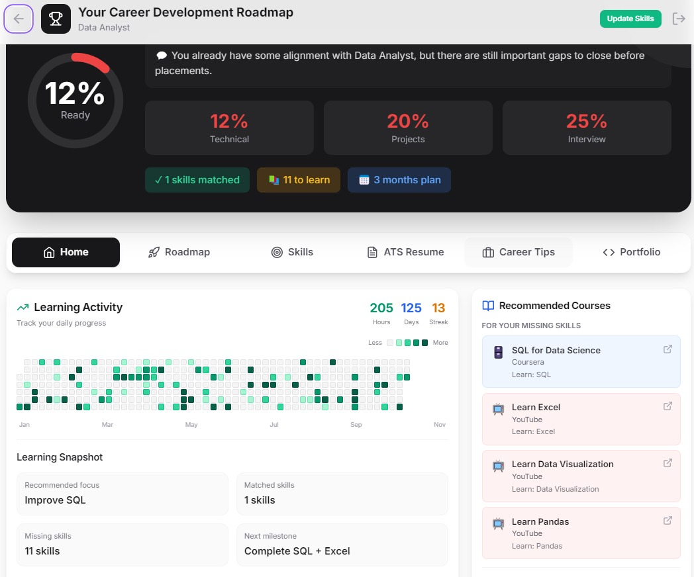
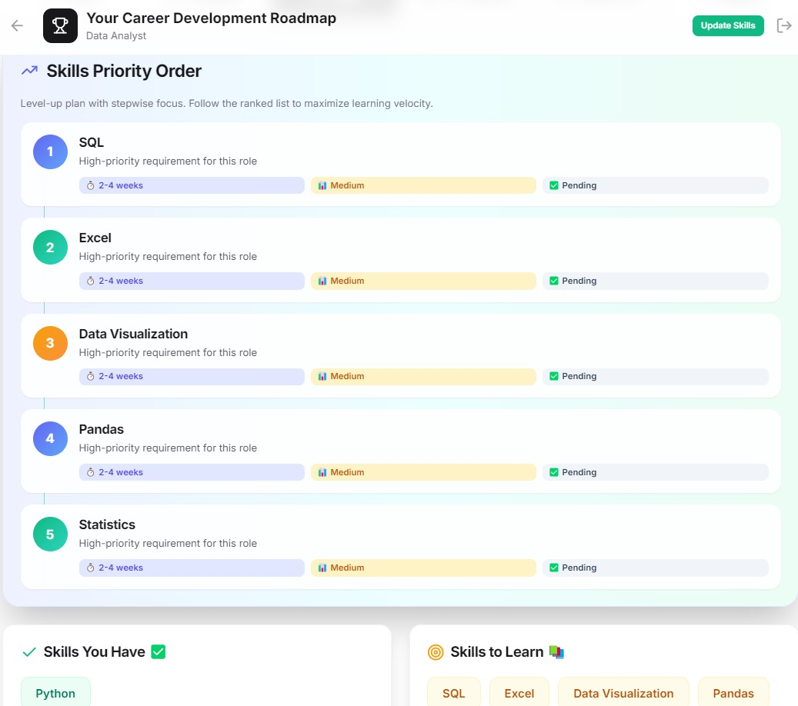
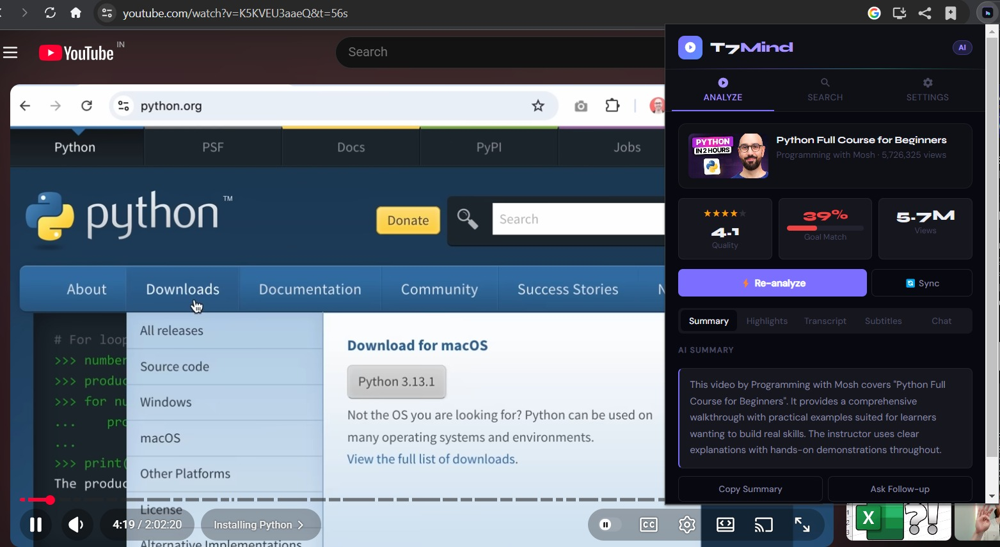
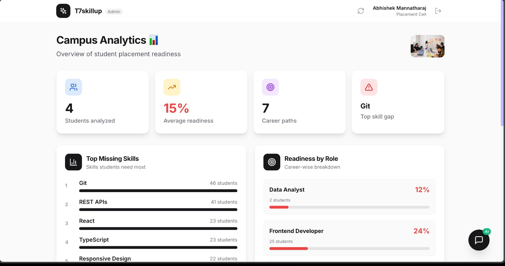
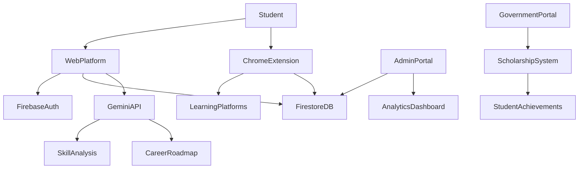

# 🚀 T7skillup

### The Intelligent Career Orchestration Engine

> **Closing the 45% Graduate Employability Gap through Semantic AI Analysis & Autonomous Learning Guardrails**

---

<p align="center">


</p>

---

<p align="center">

🌐 **Live Platform**
https://t7skillup.vercel.app

🎥 **Demo Video**
(https://youtu.be/ii0ZhFK8xOU?si=r9UxTAMu5Z9MLDtn)
</p>

---

# 📌 Vision

India produces **1.5+ million engineering graduates every year**, yet **only about 45% are employable**.

The reason is not a lack of effort — it is a **Skill-Market Mismatch**.

Traditional learning platforms provide:

❌ Static course lists
❌ No industry verification
❌ No measurable skill readiness

**T7skillup transforms career preparation into an intelligent AI-guided ecosystem.**

Students no longer follow random tutorials — they follow an **Autonomous Career Roadmap aligned with real industry demand.**

---

# 💡 The Problem

### ⚠️ The Semantic Gap

University syllabuses update every **4 years**, but industry technologies evolve every **4 months**.

### ⚠️ Passive Learning Trap

More than **70% of students lose focus on YouTube** because of recommendation rabbit holes.

### ⚠️ Institutional Blindspot

Colleges only realize **skill gaps during placements**, when it is already too late.

---

# 🚀 Our Solution

**T7skillup combines AI career intelligence with learning guardrails to create a guided career system.**

### 🧠 AI Skill Intelligence

Analyzes resumes and compares them with industry job descriptions.

### 🌳 Dynamic Skill Tree

Skills unlock only after mastery verification.

### 🛡 Learning Guardrails

Chrome extension removes distractions and enforces focused learning.

### 📊 Institutional Insights

Colleges receive real-time analytics on student readiness.

### 🏛 Government Scholarship Access

Government agencies can identify high-performing students and **grant scholarships or educational subscriptions based on verified skill achievements.**

---

# ✨ Core Ecosystem Features

---

# 🌐 Command Center (Web Platform)

### 🧠 AI Semantic Skill Audit

Using **Gemini 1.5 Flash**, the system compares:

* Student Resume
* Skill Self Assessment
* Real Industry Job Descriptions

It generates a **Career Readiness Quotient** that reflects how prepared a student is for industry roles.

---

### 🌳 Dynamic Skill Roadmap

Instead of static courses, the AI builds a **skill dependency tree**.

Example:

Python → Data Structures → Machine Learning → Deep Learning

Students must **verify skills through assessments before unlocking advanced topics.**

---

### 📊 Placement Officer / Mentor Dashboard

Placement officers, teachers, and mentors can access an **admin portal** to monitor:

* Student skill progress
* Project accomplishments
* Learning activity
* Career readiness scores
* Department-wide skill gaps

This allows **early intervention before placement season begins.**

---

### 🏛 Government Scholarship Integration

Verified skill achievements allow:

* Government bodies
* Educational foundations
* Scholarship programs

to identify talented students and provide:

* Learning platform subscriptions
* Skill scholarships
* Industry training programs

This creates a **transparent skill-based scholarship ecosystem.**

---

# 🧩 Smart Learning Guardrail (Chrome Extension)

The **T7 Chrome Extension** ensures students stay focused on their learning journey.

---

### ⏱ Smart Learning Monitoring

Tracks learning behavior across platforms like:

* YouTube
* Coursera
* Online learning websites

It measures:

* Active learning time
* Idle browsing time
* Content engagement

---

### 🛑 Educational Firewall (Study Mode)

When activated:

❌ YouTube Shorts hidden
❌ Entertainment recommendations removed
❌ Distracting content blocked

Only **career-relevant educational videos remain visible.**

---

### ⭐ AI Tutorial Quality Rating

Every tutorial receives a **0-5 star AI rating** based on:

* Transcript analysis
* Comment sentiment
* Topic relevance to student roadmap

Students therefore **watch only high quality tutorials aligned with their goals.**

---

# 📸 Platform Screenshots

---

## 🌐 Platform Dashboard

The main command center where students see their readiness score and skill roadmap.

<p align="center">
  
</p>

---

## 🧠 AI Skill Analysis

Shows AI evaluation of a student's skills against real job descriptions.

<p align="center">
  
</p>

---

## 🌳 Career Skill Tree

AI generated roadmap where skills unlock progressively.

<p align="center">
  
</p>

---

## 🧩 Chrome Extension Study Mode

Extension removes distractions and ensures focused learning.

<p align="center">
  
</p>

---

## 📊 Admin / Placement Dashboard

Mentors and placement officers can track student performance and readiness.

<p align="center">
  
</p>

---

# 🏗 System Architecture



---

# 🧰 Technology Stack

## Frontend

* React 18
* Vite
* Tailwind CSS

## Backend

* Firebase Authentication
* Firebase Firestore
* Firebase Hosting

## AI Intelligence

* Google Gemini 1.5 Flash

## Browser Extension

* Manifest V3
* Content Scripts
* Service Workers
* DOM Parsing

---

# ⚙️ Installation Guide

## Clone Repository

```bash
git clone https://github.com/your-username/T7skillup.git
```

---

## Install Dependencies

```bash
npm install
```

---

## Create Environment Variables

Create `.env`

```
VITE_FIREBASE_API_KEY=
VITE_FIREBASE_AUTH_DOMAIN=
VITE_FIREBASE_PROJECT_ID=
VITE_GEMINI_API_KEY=
```

---

## Run Development Server

```bash
npm run dev
```

---

# 🧩 Chrome Extension Setup

1. Open Chrome

```
chrome://extensions
```

2. Enable **Developer Mode**

3. Click **Load Unpacked**

4. Select the `T7extension` folder.

---

# 📊 Impact Potential

If implemented across universities:

🎓 Students gain **industry-aligned learning paths**
🏫 Colleges gain **real-time placement readiness analytics**
🏛 Governments gain **transparent scholarship distribution**
🏢 Recruiters gain **verified skill candidates**

Potential to impact **millions of students in India.**

---

# 🚀 Future Roadmap

### Phase 2

AI **Portfolio Generator** from verified skills.

### Phase 3

**Recruiter API integration** for skill-verified hiring.

### Phase 4

Collaborative **Live Study Rooms** through the extension.

---

# 👨‍💻 Team

**Abhishek**
Lead Architect & Extension Developer

**Nithelan**
Frontend & UX Specialist

**Bharath**
AI & Backend Engineer

**Abdul**
Data Scientist & Research

---

<p align="center">

### 🏆 Built at Nagarjuna College of Engineering and Technology

</p>
